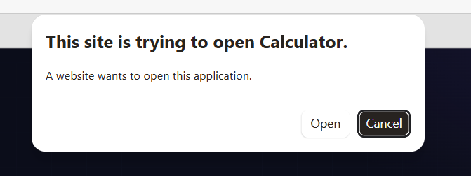

# WhatsApp Link Preview Spoofing to Arbitrary Deep-Link Invocation on iOS/macOS

In March 2026, I reported a WhatsApp vulnerability to Meta that allowed a crafted link preview to **look like a normal, trusted web link while opening an arbitrary registered URI scheme** on iOS/macOS.

## TL;DR

WhatsApp's `ExtendedTextMessage` format allowed a sender to control several parts of a link preview independently.

A crafted message could contain:
- attacker-controlled preview title
- attacker-controlled preview description
- attacker-controlled thumbnail
- an underlying matchedText using a **non-HTTP URI scheme**
- In some cases: a displayed domain that looked legitimate

For example, a preview could visually appear to point to `gmail.com`, while the URI dispatched when the user clicked it was:

`some-app://action`


## Demo

The crafted message could present a legitimate-looking preview while the click target was a non-HTTP deep link handled by another application.

**Video PoC:** [YouTube — WhatsApp deep-link preview issue](https://www.youtube.com/watch?v=PnvahsWM9M8) 

(I chose to demonstrate this using the claude code deeplink vulnerability found by [Alessandro Pignati](https://neuraltrust.ai/blog/claude-code-rce))

The important part is not the branding in the preview or any specific target application. The primitive was:

```text
What the user sees:
    normal-looking link preview

What WhatsApp opens:
    arbitrary-scheme://attacker-controlled-data
```

On affected macOS clients, clicking the preview caused WhatsApp to hand the URI to the operating system without an additional WhatsApp confirmation prompt.

## The bug

WhatsApp's `ExtendedTextMessage` contains separate fields for the visible preview and the link that is opened.

Relevant fields include:

```text
Text
MatchedText
Title
Description
JPEGThumbnail
```

A sender could construct a message where:

- `Title`, `Description`, and the thumbnail controlled what the preview looked like.
- `MatchedText` contained the URI actually opened when the preview was clicked.
- the target did not have to use `http://` or `https://`.
- the visible message could hide the raw URI, leaving only normal text plus the preview card.

So the security problem was a mismatch between **presentation** and **navigation**:

```text
attacker-controlled preview
          |
          v
looks like a normal web link
          |
       click
          |
          v
custom URI scheme
          |
          v
iOS/macOS URL handler
          |
          v
installed application + additional attacker-controlled parameters
```

## Hiding the real target

The PoC also used a renderer behavior that made the attack much less obvious.

The message body was built roughly as:

```go
msgText := targetURI + "\n\n\n" + body
```

and the same URI was supplied as `MatchedText`.

Because the URL at the beginning of `Text` matched `MatchedText`, WhatsApp hid that leading URL line in the rendered message.

The recipient therefore saw the normal message text and the crafted preview, rather than the raw custom URI.

## Minimal PoC shape

The full PoC used [whatsmeow](https://github.com/tulir/whatsmeow) to send the crafted protobuf.

The core of the issue can be reduced to something like this:

```go
targetURI := "custom-scheme://attacker-controlled-data"
body := "Check this out..."

msgText := targetURI + "\n\n\n" + body

msg := &waE2E.Message{
    ExtendedTextMessage: &waE2E.ExtendedTextMessage{
        Text:          proto.String(msgText),
        MatchedText:   proto.String(targetURI),
        Title:         proto.String("Attacker-controlled title"),
        Description:   proto.String("Attacker-controlled description"),
        PreviewType:   waE2E.ExtendedTextMessage_IMAGE.Enum(),
        JPEGThumbnail: thumbBytes,

        // Thumbnail upload metadata omitted here.
    },
}
```

The full PoC also uploaded the preview image through WhatsApp's link-thumbnail media flow and populated the thumbnail metadata used by the receiving client.

The important point is that the preview metadata and the actual URI target were controlled independently enough to make a custom application deep link appear like an ordinary web preview.

## Why this matters

This is more interesting than normal URL spoofing because the click can leave the browser/web security model entirely.

A normal link usually looks like:

```text
WhatsApp -> https://example.com -> browser
```

With this bug, the flow could instead be:

```text
WhatsApp -> custom-scheme://... -> OS dispatcher -> installed application + attacker-controlled parameters
```

Many desktop and mobile applications register URI handlers for operations such as authentication, opening resources, joining calls, importing content, or launching application-specific actions.

That means the practical impact depends partly on which handlers are installed and how safely those applications process deep links.

I explored several such handlers while testing, but I think the cleanest description of the WhatsApp bug itself is:

> **Arbitrary URI scheme invocation through a spoofed link preview.**

That description does not depend on a particular downstream application or exploit chain.

A website may attempt to open a deeplink for the user, but the browser prompts a warning to the user: 




$${\color{red}**WhatsApp\space did\space NOT\space ask\space the\space user\space at\space all\space before\space opening\space the\space arbitrary\space deeplink**}$$

## Disclosure timeline

| Date | Event |
|---|---|
| **2026-03-28** | Report submitted to Meta |
| **2026-05-27** | Meta began investigating |
| **2026-05-28** | Additional macOS PoC provided |
| **2026-06-02** | Meta confirmed reproduction and forwarded the issue to engineering |
| **2026-06-26** | $1,000 bounty awarded |
| **2026-07-24** | Meta confirmed the issue had been patched |
| **2026-09-11** | Meta confirmed that no CVE would be assigned |

Meta's final description of the accepted impact was:

> "the deeplink's ability to invoke an arbitrary URL handler from installed apps."

## Bounty / CVE

Meta awarded **$1,000** for the finding.

I asked them to reconsider the severity and whether the issue should receive a CVE, since this was a client-side vulnerability that required users to update their WhatsApp client to be protected.

Meta kept the bounty at $1,000 and decided not to assign a CVE.

I disagree with the severity assessment, mainly because the primitive crossed a boundary from a WhatsApp message into arbitrary installed application URI handlers while allowing the action to be disguised behind a normal-looking link preview.

